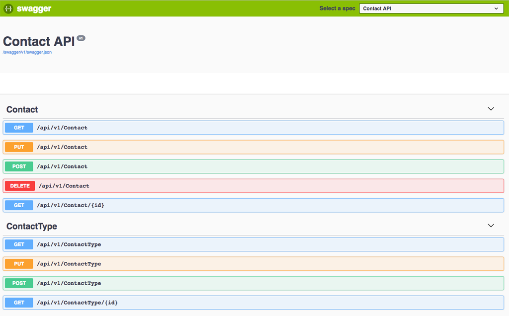

# Contact API 
Seja bem-vindo ao repositório Client API.

Aqui irei demonstrar, de forma simples e prática, uma Web API para gerenciar contatos.

## Tecnologias Implementadas
* AspNet.Core 2.1.4
* Visual Studio Code
* MacOS
* Fluent API
* Microsoft EntityFrameWorkCore
* Swashbuckle.AspNetCore.Swagger
* Git e GitHub

## Sobre o Código Fonte

~~O código não está completo.~~

O código está finalizado

~~Então, você pode acompanhar a evolução do projeto através dos Commits e do logbook que será criado.~~

Você pode conferir como foi a evolução do projeto através dos Commits e do logbook.

## Logbook

### **#01 - Definição do escopo do projeto / Criação da estrutura inicial** ##

*Clonagem do repositório usando o terminal do Visual Studio Code e linha de comando git clone https://github.com/oneil-marcelo/contact-api.git*

*Criação das pastas Controllers, Data, Models, Repositories. A medida que for avançando, o objetivo de cada pasta será detalhado.*

### **#02 - Criação das entidades (Modelos de dados)** ###

*A pasta Models, criada na estrutura inicial do projeto, será usada para salvar as entidades.*

*As entidades serão utilizadas como objetos de representação do banco de dados. Elas serão utilizadas tanto na criação do banco, como modelo para entrada e saída de dados da API.*

### **#03 - Fluent Map / Criação do contexto para geração do banco de dados** ###
*Na pasta Data, foi criada a classe AppDataContext. Ela é responsável por criar o contexto para geração do banco e manipulação dos dados*

*Também foi criada uma pasta Maps, onde estão as classes responsáveis por mapear as propriedades das entidades e com isso criar as tabelas no banco de dados*

*Para isso foi instalado o pacote do Entity framework Core 2.1.1 => dotnet add package Microsoft.EntityFrameWork --version 2.1.1*

### **#04 - Repository Pattern / Depency Injection** ###
*Na pasta Repositories, para cada entidade, foram criadas uma interface para assinatura dos métodos e uma classe para implementação dos metódos*

*O contexto para implementação dos métodos foi passado via Injeção de dependência*

*A classe STARTUP.CS, na raiz da aplicação, foi modificada e é a responsável por essa injeção de dependência.*

*Por último, foi gerado o banco de dados utilizando migrations, através da linha de comando => dotnet ef migrations add Initial.* 

*Na linha de comando,  o termo Initial é o nome da migration e pode ser usado para executar downgrade, por exemplo.*

### **#5 - Controllers da Api / Routes / Versionamento** ###

*Assim como na pasta repositories, na pasta Controllers foi criado uma classe para cada entidade*

*O repositório para implementação dos métodos foi passado via Injeção de dependência. Novamente a classe Startup.cs foi responsável*

*Nessa etapa a classe STARTUP.CS foi alterada. Ela é responsável pela injeção de dependência nos controllers e também adicionar o middleware Mvc.*

*Mvc foi adicionado através do comando => dotnet add package Microsoft.AspNetCore.Mvc --version 2.1.1*

*As classes controllers herdam de controller e as rotas e métodos são definidos através do decorador [Route("<api/v1/[controller]")].*

*Os métodos HTTP também foram definidos através dos decoradores [HttpGet], [HttpPost], [HttpPut] e [HttpDelete]. Os parametros de entradas serão recebidos de duas formas:*

*Via url, implementando o decorador [HttpGet("{id}")] e depois sendo recuperado no método. Ex: getContactById(int id).*

*Recebendo no corpo da página e depois recuperando no método. Ex: AddContact([FromBody] Contact model).* 

*Todos os métodos nos controllers retornam um http response*

### **#6 - Documentação da Api** ###

*Para documentar a Api, foi utilizado o Swagger*

*Pacote foi instalado através da linha de comando dotnet add package Swashbuckle.AspNetCore.Swagger*

*A classe STARTUP.CS foi novamente implementada para adição e uso do pacote*

